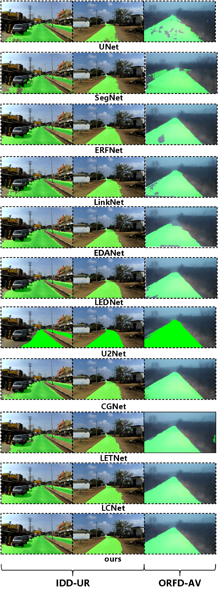
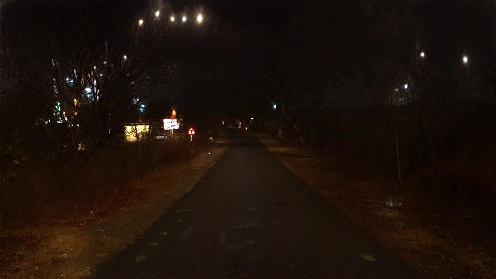

# AXON-Net：面向非结构化道路分割的轻量化轴向上下文网络

[](https://pytorch.org/)
[](./LICENSE)
[]()

**AXON-Net** 是一种面向**非结构化道路语义分割**的轻量化 U-Net 风格网络。模型引入：
- **CASAB**：通道-空间注意力（Channel-Spatial Attention）
- **LightPCT**：轻量化部分上下文变换器（Lightweight Partial Context Transformer）
- **DPCF-TSE**：细结构增强（Thin-Structure Enhancement）

在保持较低计算成本的同时，兼顾**全局上下文建模**与**边界/细结构恢复**。

> ⚠️ **重要说明**
> - 本项目目前处于**活跃研究阶段**（正在推进低光照/极端场景扩展研究）。
> - 因此，本仓库仅开源**核心模型结构定义**与**损失函数实现**，供学术参考。
> - 完整训练脚本、预训练权重及清洗后的数据集暂不公开（后续视研究进展决定）。

---

## 📂一、 仓库内容

```text
├── src/
│   └── AXONNet.py                 # 网络模型定义
├── train_utils/
│   └── dice_coefficient_loss.py   # 复合损失函数集合
├── my_dataset.py                  # 数据集加载器（适配 TP-Dataset 格式）
├── transforms.py                  # 数据增强与预处理变换
└── README.md                      # 项目说明
````

---

## 🧼二、 数据预处理与清洗流程

为降低原始数据噪声、并使模型更聚焦于非结构化道路特征，我们对以下公开数据源进行了清洗与重构：

* **IDD Part I**（印度道路场景全景分割数据的一部分）
* **ORFD**（越野/非铺装道路相关数据）

在统一二值化、格式校验、异常样本剔除等流程后，形成更匹配本研究目标的数据集：

* **IDD-UR**
* **ORFD-AV**

> 数据集当前暂不公开：由于仍在推进后续研究（低光照/夜间与极端场景方向），为保证实验闭环与可控性，暂不发布清洗后的完整数据。

---

## 🖼️ 三、结果可视化

为直观展示 AXON-Net 的阶段性性能与后续研究潜力，我们提供如下推理结果示例。

### 1）AXON-Net 实验对比推理图（IDD-UR / ORFD-AV）

<p align="center">
  
</p>
<p align="center"><em>图 1：AXON-Net 在非结构化复杂场景下的分割表现</em></p>

---

## 🚀 四、后续研究规划：低光照/夜间与极端场景扩展

在非结构化道路分割的研究主线基础上，我们正在推进面向**低光照/夜间等极端场景**的更鲁棒分割算法，并探索引入 **Mamba / State Space Models（SSM）** 等线性复杂度方向，以突破传统 CNN/Transformer 在复杂退化场景下的效率与性能瓶颈。以下为阶段性探索结果示例（部分结果来自正在推进的新模型）。

### 2）低光照/夜间样例（阶段性结果）

<p align="center">
  <strong>低光照输入（Input） vs 新模型初步推理（Inference）</strong><br>
  
  
</p>
<p align="center"><em>样本 01：低光照输入与推理结果对比</em></p>

<p align="center">
  <strong>真值（Ground Truth） vs 预测掩膜（Prediction）</strong><br>
  
  
</p>
<p align="center"><em>样本 02：GT 与预测 Mask 对比</em></p>

---

## 📝 引用（Citation）

待录用后更新。


